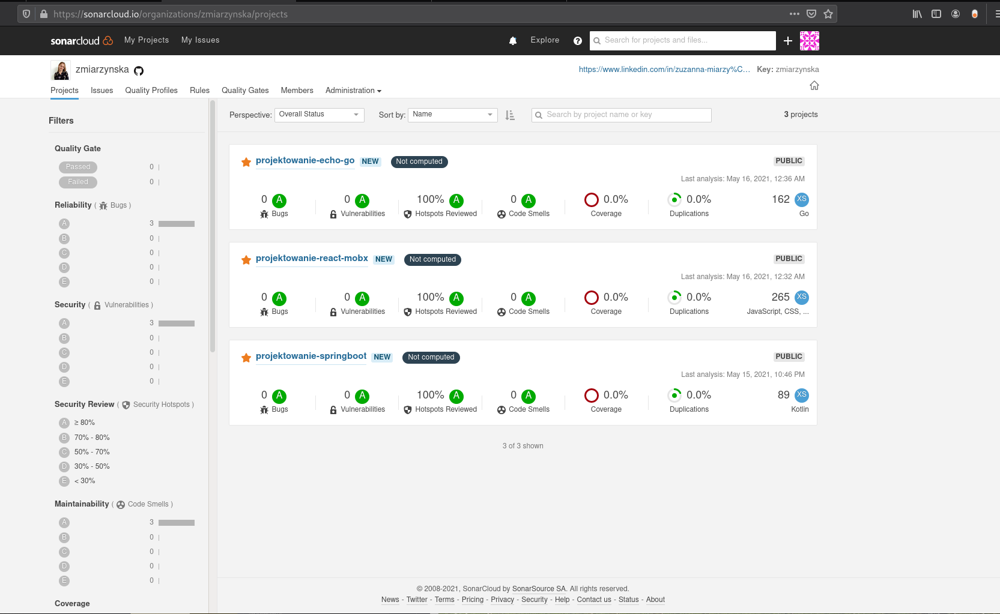
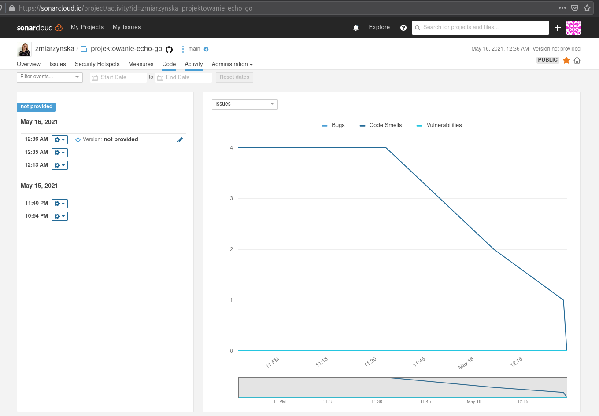
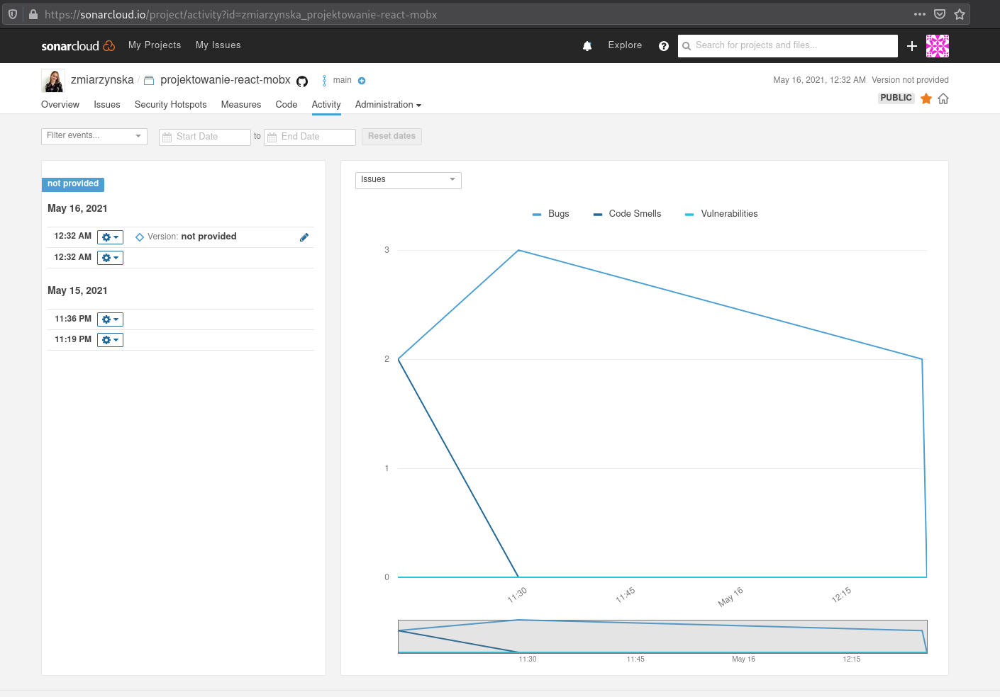
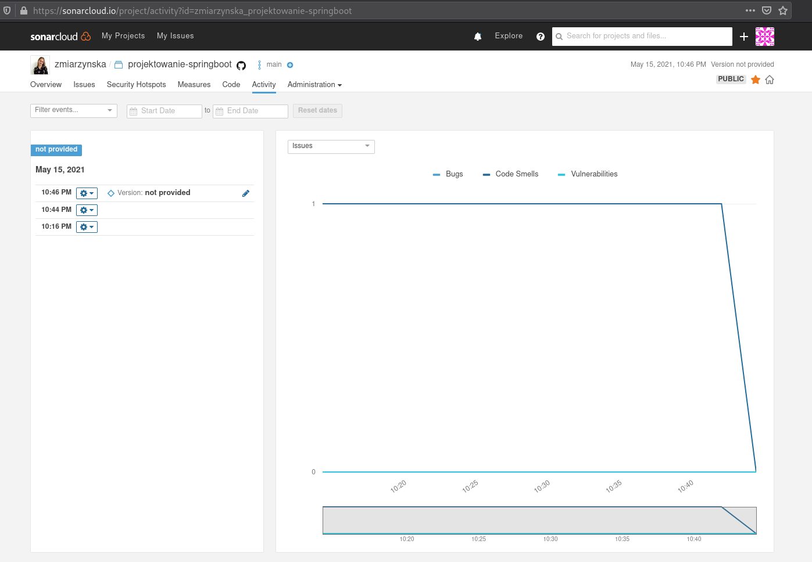

# projektowanie-sonarcloud

W zadaniu przeanalizowałam 3 projekty z kursu. Projekty:

- Go / Echo  https://github.com/zmiarzynska/projektowanie-echo-go

- React / Mobx https://github.com/zmiarzynska/projektowanie-react-mobx

- Kotlin / SpringBoot https://github.com/zmiarzynska/projektowanie-springboot

Strona główna w aplikacji SonarCloud wygląda po naprawach następująco: 

Link : https://sonarcloud.io/organizations/zmiarzynska/projects

1. Echo/GO
https://github.com/zmiarzynska/projektowanie-echo-go

Dodane zostały pliki: 
-./.github/workflow/build.yml  https://github.com/zmiarzynska/projektowanie-echo-go/blob/main/.github/workflows/build.yml

-./sonar-project.properties https://github.com/zmiarzynska/projektowanie-echo-go/blob/main/sonar-project.properties

Aktywnosc w projekcie: 

2. Mobx/React
https://github.com/zmiarzynska/projektowanie-react-mobx

Dodane zostały pliki: 
-./.github/workflow/build.yml https://github.com/zmiarzynska/projektowanie-react-mobx/blob/main/.github/workflows/build.yml 

-./sonar-project.properties https://github.com/zmiarzynska/projektowanie-react-mobx/blob/main/sonar-project.properties

Aktywnosc w projekcie: 

3. SpringBoot/Kotlin
https://github.com/zmiarzynska/projektowanie-springboot

Dodane zostały pliki: 
-./.github/workflow/build.yml  https://github.com/zmiarzynska/projektowanie-springboot/blob/main/.github/workflows/build.yml 

-./sonar-project.properties https://github.com/zmiarzynska/projektowanie-springboot/blob/main/sonar-project.properties

Aktywnosc w projekcie: 

